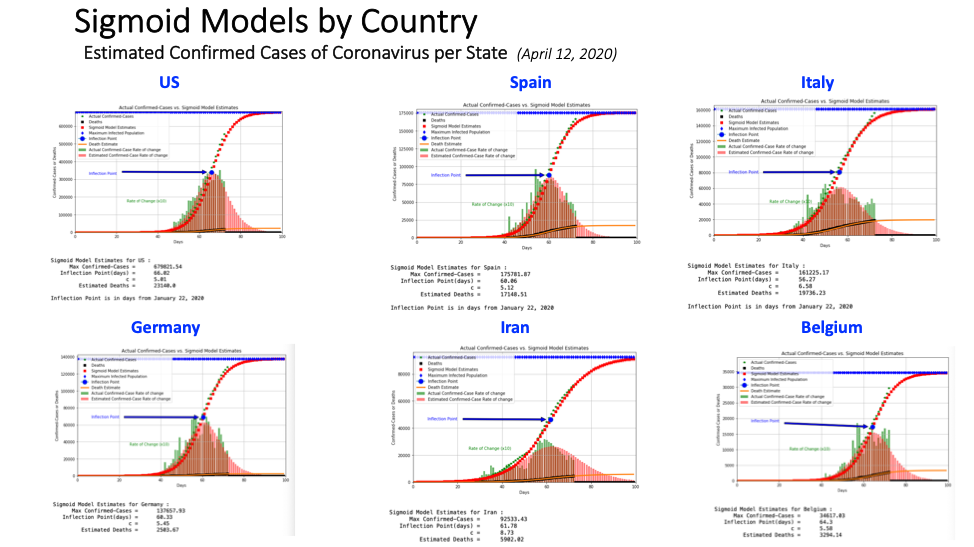
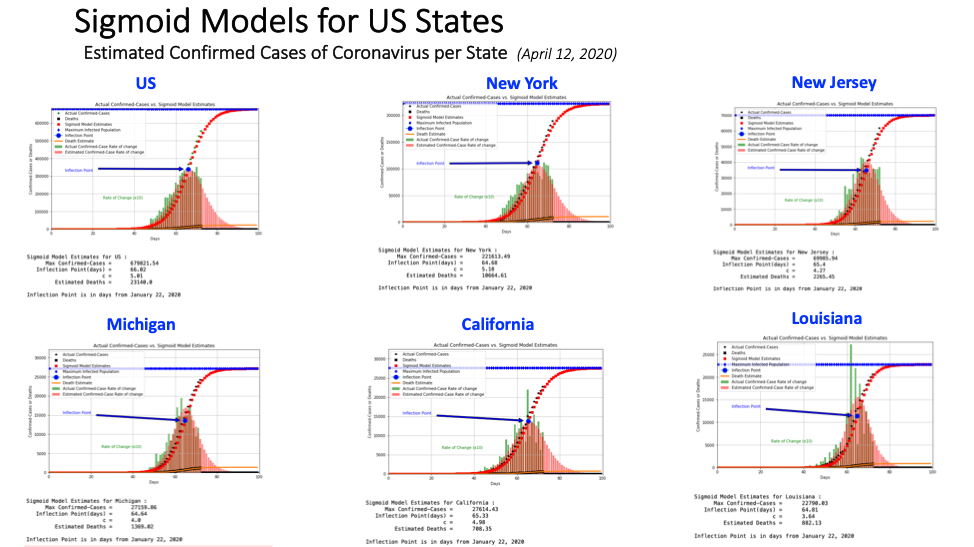

# COVID-19-Estimates-of-Confirmed-Cases_from-Sigmoid-Model
# *** This method is not applicable for US data since the second wave starting around June 1. ***
COVID-19 Estimates of Confirmed Cases and Deaths using Sigmoid Model for Countries or US States

### The Notebooks Version 8 auto will download the most current Johns Hopkins COVID data and then make estimates for the maximum expected Confirmed-Cases and Deaths by country or state.

Beginning in January of 2020 we have witnessed a pandemic the likes of which very few people have ever seen. As we have surpassed 3 million Confirmed Cases as of April 28, 2020 we as a world appear to be on the downside of the rate of new cases each day.  This COVID-19 disease as it has spread from China, Middle East, Europe, Africa and the US, killing over 200,000 souls. Is there anything that we as individuals can do to better to understand how this disease has spread throughout the world? How many more are yet to be affected by COVID-19? This is at the heart of of this notebook as we attempt to develop tools to forecast Confirmed Cases and Deaths using the data being furnished by Johns Hopkins on a daily basis.  

Our primary objective is to commit our ideas, concepts and methods into code using the data that we are being furnished. We want to share these concepts with true Data Scientists so that hopefully we can better understand and forecast this pandemic. The model being presented in this notebook employs the most current data being updated every day. We are using ML to generate predictive estimations of the maximum expected Confirmed Cases by country/region and create reasonable timelines for these occurrences.

Most of us are familiar with the data. China (mainly Hubei), has been at the epicenter of this pandemic starting around in  January of 2020, and from there on to Europe and then around the world. Since the Far East is more mature in the evolution of this pandemic, we are already seeing trends in the Far East flatten out in their numbers of confirmed cases of COVID; namely Hubei, China and South Korea. Most countries; however, are still in the exponential growth stage of their COVID development. Using the data from Hubei and South Korea we were able to fit regression curves to these data to model the entire evolutionary trend of these data. Of noticeable importance was a version of the Sigmoid curve-fit equation as shown below. Yes, there were equations that had better fits (r2) to these data; however, the Sigmoid equation has fit parameters that represent meaningful parameters to us the users.

                    y = a/(1 + exp(-(days - b)/c))

From the Sigmoid equation the parameter "a" relates to the maximum number of estimated Confirmed Cases that we might expect. From the data that we have reviewed we have found two excellent examples (shown below) that allow us to fit these data over the entire range of the features found in the Sigmoid curve. The parameter "b" relates to the inflection point on the curve that is at the 50th percentile. For most countries we are just approaching this inflection point in the data. The Sigmoid equation does a reasonable job of estimating this parameter, but with such explosive growth in confirmed cases this is still very hard to estimate accurately. Once predicted, we have a reasonable estimates of Confirmed Cases beyond the data we have today. "c" defines the rate of slope in the initial phase of Confirmed Cases. I am not an Epidemiologist and our estimates are strictly based on the data at hand.

These COVID data trends have certain characteristics by country/region as pointed out by Tomas Pueyo in the Medium article, "Coronavirus: The Hammer and the Dance". Tomas did an excellent job of describing these artifacts in the Hubei data in relationship to what he called the "Hammer and the Dance". Even with the break in slope and inconsistencies in the Hubei Confirmed Cases data, the Sigmoid model still fit the data rather well over the entire range of data having an r2 of 0.9943. The South Korean data appears be exhibiting similar inconsistencies too, especially with the recent data. There is a late, new trend that is higher than our estimate as the result of the "Dance" phase. In the differential rate curve of Confirmed Cases for South Korea the data confirms that we are presently in that Dance phase with low, but persistent cases being reported daily.

In this study we fit the most current COVID data to our Sigmoid equation model generating an estimating for the maximum number of Confirmed Cases expected and the 50th Percentile or inflection point in these data. Since very few countries or regions have even approached the maximum Confirmed Cases value as seen by the flattening of the curve, then it is the inflection point that is presently giving us rough estimates of where we are on that curve, and what me might anticipate for the future. Again, these are only estimates as shown below with uncertainty. As of this date we have not quantified the uncertainty, but judging by the Hubei and South Korea, this uncertainty will decrease with time. Our most imortant tool is the day-to-day rate of change in the number of Confirmed Cases.  This is very useful in helping us understand where we are on the evolutionary timeline.

### The Notebooks Version 8 auto will download the most current Johns Hopkins COVID data and then make estimates for the maximum expected Confirmed-Cases and Deaths by country or state.You might need to create the './kaggle/input/covid19dailydata/' subdirectory under these notebooks to store the downloaded data. 
